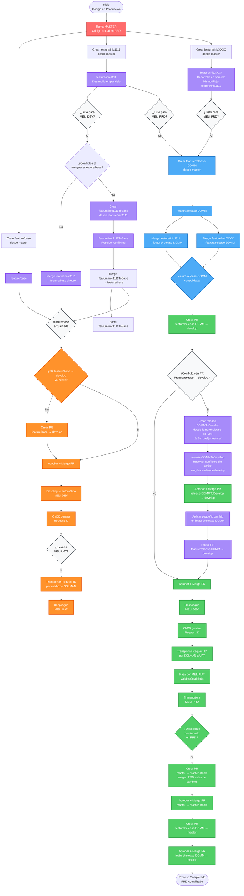

# 🚀 Estrategia de Branching Git para MELI

> Gestión de desarrollo paralelo con integración continua y despliegues controlados

## 📋 Tabla de Contenidos

- [Diagrama de Flujo](#-diagrama-de-flujo-completo)
- [Estructura de Ramas](#-estructura-de-ramas)
- [Flujo de Trabajo](#-flujo-de-trabajo-detallado)
  - [Fase 1: Desarrollo](#fase-1-desarrollo-de-iniciativa-)
  - [Fase 2: MELI DEV](#fase-2-despliegue-a-meli-dev-)
  - [Fase 3: MELI UAT](#fase-3-transporte-a-meli-uat-)
  - [Fase 4: Preparación PRD](#fase-4-preparación-para-meli-prd-)
  - [Fase 5: MELI PRD](#fase-5-despliegue-a-meli-prd-)
- [Reglas y Prácticas](#️-reglas-y-mejores-prácticas)
- [Nomenclatura](#-convenciones-de-nomenclatura)
- [Ambientes](#-ambientes)

---

## 📊 Diagrama de Flujo Completo


```mermaid
flowchart TD
    Start([Inicio:<br/>Código en Producción]) --> Master[Rama MASTER<br/>Código actual en PRD]
    
    
    Master --> CreateBase[Crear feature/base<br/>desde master]
    Master --> CreateDev1[Crear feature/inic1111<br/>desde master]    
    Master --> CreateDevN[Crear feature/inicXXXX<br/>desde master]
       
    CreateBase --> Base[feature/base]
    CreateDev1 --> Dev1[feature/inic1111<br/>Desarrollo en paralelo]    
    CreateDevN --> DevN[feature/inicXXXX<br/>Desarrollo en paralelo<br/>Mismo Flujo feature/inic1111]
    
    %% Flujo para MELI DEV
    Dev1 --> DecisionDev1{¿Listo para<br/>MELI DEV?}
    DecisionDev1 -->|Sí| ConflictBase{¿Conflictos al<br/>mergear a feature/base?}
    ConflictBase -->|No| MergeDirectBase[Merge feature/inic1111<br/>→ feature/base directo]
    ConflictBase -->|Sí| CreateTrans1[Crear feature/inic1111ToBase<br/>desde feature/inic1111]
    CreateTrans1 --> Trans1[feature/inic1111ToBase<br/>Resolver conflictos]
    Trans1 --> MergeToBase1[Merge feature/inic1111ToBase<br/>→ feature/base]
    MergeToBase1 --> DeleteTrans1[Borrar<br/>feature/inic1111ToBase]

    Base --> BaseLista
    MergeDirectBase --> BaseLista
    MergeToBase1 --> BaseLista{feature/base<br/>actualizada}
    
    BaseLista --> PRDevExists{¿PR feature/base → develop<br/>ya existe?}
    PRDevExists -->|No| CreatePRDev[Crear PR<br/>feature/base → develop]
    PRDevExists -->|Sí| ApproveDev
    CreatePRDev --> ApproveDev[Aprobar + Merge PR]
    ApproveDev --> DeployDev[Despliegue automático<br/>MELI DEV]
    DeployDev --> RequestIDDev[CI/CD genera<br/>Request ID]
    
    %% Flujo para MELI UAT
    RequestIDDev --> DecisionUAT{¿Llevar a<br/>MELI UAT?}
    DecisionUAT -->|Sí| TransportUAT[Transportar Request ID<br/>por medio de SOLMAN]
    TransportUAT --> DeployUAT[Despliegue<br/>MELI UAT]
    
    %% Flujo para MELI PRD
    Dev1 --> DecisionPRD1{¿Listo para<br/>MELI PRD?}
    DevN --> DecisionPRDN{¿Listo para<br/>MELI PRD?}
    
    DecisionPRD1 -->|Sí| CreateRelease[Crear feature/release-DDMM<br/>desde master]
    DecisionPRDN -->|Sí| CreateRelease
    
    CreateRelease --> Release[feature/release-DDMM]
    Release --> MergeInit1[Merge feature/inic1111<br/>→ feature/release-DDMM]
    Release --> MergeInitN[Merge feature/inicXXXX<br/>→ feature/release-DDMM]
    
    MergeInit1 --> ReleaseReady
    MergeInitN --> ReleaseReady{feature/release-DDMM<br/>consolidada}
    
    ReleaseReady --> PRProd[Crear PR<br/>feature/release-DDMM → develop]
    
    PRProd --> ConflictCheck{¿Conflictos en PR<br/>feature/release → develop?}
    ConflictCheck -->|No| ApproveProd[Aprobar + Merge PR]
    ConflictCheck -->|Sí| CreateReleaseTrans[Crear release-DDMMToDevelop<br/>desde feature/release-DDMM<br/>⚠️ Sin prefijo feature/]
    CreateReleaseTrans --> ReleaseTrans[release-DDMMToDevelop<br/>Resolver conflictos sin omitir<br/>ningún cambio de develop]
    ReleaseTrans --> ApproveMergeReleaseTrans[Aprobar + Merge PR<br/>release-DDMMToDevelop → develop]
    ApproveMergeReleaseTrans --> SmallChange[Aplicar pequeño cambio<br/>en feature/release-DDMM]
    SmallChange --> RetryPR[Nuevo PR<br/>feature/release-DDMM → develop]
    RetryPR --> ApproveProd
    
    ApproveProd --> DeployDevProd[Despliegue<br/>MELI DEV]
    DeployDevProd --> RequestIDProd[CI/CD genera<br/>Request ID]
    
    RequestIDProd --> TransportProd[Transportar Request ID<br/>por SOLMAN a UAT]
    TransportProd --> UATCheck[Pasa por MELI UAT<br/>Validación aislada]
    UATCheck --> TransportPRD[Transporte a<br/>MELI PRD]
    
    %% Actualización post-producción    
    TransportPRD --> ConfirmPRD{¿Despliegue<br/>confirmado<br/>en PRD?}
    ConfirmPRD -->|Sí| PRMasterStable[Crear PR<br/>master → master-stable<br/>Imagen PRD antes de cambios]
    PRMasterStable --> ApproveMasterStable[Aprobar + Merge PR<br/>master → master-stable]
    ApproveMasterStable --> UpdateMaster[Crear PR<br/>feature/release-DDMM → master]
    UpdateMaster --> ApproveMergeMaster[Aprobar + Merge PR<br/>feature/release-DDMM → master]
    ApproveMergeMaster --> End([Proceso Completado<br/>PRD Actualizado])
    
    %% Estilos
    classDef mainBranchStyle fill:#ff6b6b,stroke:#c92a2a,stroke-width:3px,color:#fff
    classDef featureBranchStyle fill:#a78bfa,stroke:#7c3aed,stroke-width:2px,color:#fff
    classDef releaseBranchStyle fill:#4dabf7,stroke:#1971c2,stroke-width:2px,color:#fff
    classDef devPathStyle fill:#ff922b,stroke:#e8590c,stroke-width:2px,color:#fff
    classDef prdPathStyle fill:#51cf66,stroke:#2f9e44,stroke-width:2px,color:#fff
    classDef decisionStyle fill:#f8f9fa,stroke:#495057,stroke-width:2px,color:#000
    
    class Master mainBranchStyle
    class Base,Dev1,DevN,Trans1,CreateTrans1,MergeDirectBase featureBranchStyle
    class Release,CreateRelease,MergeInit1,MergeInitN,ReleaseReady releaseBranchStyle
    class PRDevExists,CreatePRDev,ApproveDev,DeployDev,RequestIDDev,TransportUAT,DeployUAT devPathStyle
    class PRProd,ApproveProd,DeployDevProd,RequestIDProd,TransportProd,UATCheck,TransportPRD,ConfirmPRD,PRMasterStable,ApproveMasterStable,UpdateMaster,ApproveMergeMaster prdPathStyle
    class CreateReleaseTrans,ReleaseTrans,SmallChange,RetryPR featureBranchStyle
    class ApproveMergeReleaseTrans prdPathStyle
    class DecisionDev1,DecisionPRD1,DecisionPRDN,DecisionUAT,BaseLista,ConflictCheck decisionStyle
```

### 🎨 Leyenda de Colores

| Color | Descripción |
|-------|-------------|
| 🔴 **Rojo** | Ramas principales (master) |
| 🟣 **Morado** | Ramas feature (feature/inic*, feature/*ToBase) |
| 🔵 **Azul claro** | Ramas release/base (feature/release-DDMM, feature/base) |
| 🟠 **Naranja** | Flujo DEV - Despliegue a MELI DEV/UAT |
| 🟢 **Verde** | Flujo PRD - Despliegue a MELI PRD |
| ⚪ **Gris** | Decisiones y puntos de control |

---

## 🌳 Estructura de Ramas

| Rama | Propósito | Ciclo de Vida |
|------|-----------|---------------|
| `master` 🔒 | Refleja el código en producción (MELI PRD) | Permanente |
| `master-stable` 🔒 | Imagen del estado de PRD antes de cada despliegue (snapshot previo) | Permanente |
| `develop` 🔒 | Rama de integración para despliegues automáticos | Permanente |
| `feature/inicXXXX` | Desarrollo de iniciativas individuales en paralelo | Temporal |
| `feature/base` | Rama de consolidación para múltiples iniciativas que van a DEV | Semi-permanente |
| `feature/inicXXXXToBase` | Rama de transición para resolver conflictos antes del merge | Temporal |
| `feature/release-DDMM` | Consolida iniciativas listas para PRD (siempre requerida) | Temporal |

> 🔒 **Ramas Protegidas:** `master` y `develop` son ramas protegidas. Solo se pueden actualizar mediante Pull Request aprobado.

---

## 🔄 Flujo de Trabajo Detallado

### Fase 1: Desarrollo de Iniciativa 🔧

**1. Crear rama de iniciativa desde master**

```bash
git checkout master
git pull origin master
git checkout -b feature/inic1111
```

**2. Desarrollar la funcionalidad**

Commits frecuentes en `feature/inic1111`

**3. Crear rama de transición**

```bash
git checkout feature/inic1111
git checkout -b feature/inic1111ToBase
```

**4. Hacer merge a feature/base**

```bash
git checkout feature/base
git merge feature/inic1111ToBase
git push origin feature/base
```

**5. Borrar rama de transición**

```bash
git branch -d feature/inic1111ToBase
git push origin --delete feature/inic1111ToBase
```

> 💡 **Nota:** Si ya existe un PR abierto de `feature/base → develop`, simplemente actualiza la rama. Si no existe, créalo y solicita aprobación.

---

### Fase 2: Despliegue a MELI DEV 🚀

**1. Aprobar el PR y ejecutar el Merge**

La aprobación permite hacer el merge. El merge dispara el despliegue automático a MELI DEV.

**2. CI/CD genera Request ID automáticamente**

Este ID se usa para transportar el código a otros ambientes

**3. Validación en MELI DEV**

Probar la funcionalidad en el ambiente de desarrollo

---

### Fase 3: Transporte a MELI UAT 🧪

> ⚠️ **Importante:** El transporte a UAT se usa para pruebas de aceptación de usuario o cuando no se cuenta con datos en ambiente MELI DEV.

**1. Transportar Request ID a través de SOLMAN**

Usar SOLMAN para mover el Request ID de DEV a UAT

**2. Validación en MELI UAT**

Realizar pruebas de aceptación o validar con datos reales

---

### Fase 4: Preparación para MELI PRD 📦

> 📦 **Importante:** Siempre se debe crear una rama release para pasar a producción, independientemente de si es una o múltiples iniciativas.

**1. Crear rama de release**

```bash
git checkout master
git pull origin master
git checkout -b feature/release-1201
# Formato: DDMM (día y mes)
```

**2. Consolidar iniciativa(s)**

```bash
# Para una iniciativa:
git merge feature/inic1111
git push origin feature/release-1201

# Para múltiples iniciativas:
git merge feature/inic1111
git merge feature/inic2222
git push origin feature/release-1201
```

**3. Crear PR desde la release**

```bash
# Crear PR: feature/release-1201 → develop
```

**4. Resolver conflictos (si aplica)**

> ⚠️ **Importante:** Si el PR presenta conflictos, **no resolver directamente sobre el PR**. Seguir el flujo de rama temporal para garantizar que lo que va a PRD sea exactamente lo que contiene la release.

```bash
# Crear rama temporal desde develop (SIN prefijo feature/ para no disparar CI/CD)
git checkout develop
git pull origin develop
git checkout -b release-1201ToDevelop

# Mergear la release sobre la rama temporal y resolver conflictos
git merge feature/release-1201
# ⚠️ Resolver conflictos sin omitir NINGÚN cambio de develop
# Priorizar los cambios de develop para evitar pérdida de información
git add .
git commit -m "Resolve conflicts: release-1201 vs develop"
git push origin release-1201ToDevelop
```

```bash
# Volver a feature/release-1201 y aplicar un pequeño cambio (ej: espacio, comentario)
# para que GitHub reconozca el PR actualizado sin conflictos
git checkout feature/release-1201
# Aplicar cambio menor (ej: actualizar fecha en encabezado, agregar línea en blanco)
git add .
git commit -m "Minor adjustment to re-trigger PR without conflicts"
git push origin feature/release-1201
```

Una vez resueltos los conflictos, crear un PR de `release-1201ToDevelop → develop`, aprobarlo y mergearlo.

Después de ese merge, eliminar la rama temporal:

```bash
git branch -d release-1201ToDevelop
git push origin --delete release-1201ToDevelop
```

El PR `feature/release-1201 → develop` ya no debería tener conflictos.

> 💡 **Por qué este flujo:** La rama temporal `release-DDMMToDevelop` absorbe todos los cambios de `develop`, asegurando que nada se pierda. Al actualizar `feature/release-DDMM` con un cambio mínimo, el PR queda limpio y lo que se despliega a PRD corresponde exactamente al contenido de la release.

**5. Aprobar el PR y ejecutar el Merge**

El merge dispara el despliegue a MELI DEV y genera el Request ID para transportar a UAT y PRD.

---

### Fase 5: Despliegue a MELI PRD ✅

> ✅ **Flujo de Producción:** El código desplegado en DEV se transporta a UAT → PRD usando SOLMAN.

**1. Verificar despliegue en MELI DEV**

El merge de la Fase 4 generó un Request ID automáticamente.

**2. Transportar a MELI UAT**

Validación aislada vía SOLMAN

**3. Transportar a MELI PRD**

Despliegue final a producción

**4. Confirmar despliegue en PRD**

Validar funcionamiento

**5. Generar snapshot de PRD en master-stable**

> 📸 **Importante:** Antes de actualizar `master`, se debe crear un PR de `master → master-stable`. Esto permite conservar una imagen del estado de PRD *antes* de los cambios transportados, útil para rollback o comparación.

```bash
# Crear PR: master → master-stable
# Aprobar y mergear para capturar el estado actual de PRD
```

**6. Actualizar master**

```bash
# Crear PR: feature/release-DDMM → master
# Aprobar y mergear el PR → master estará actualizado
```

> 🔒 **Nota:** Las ramas protegidas (master, master-stable, develop) solo se actualizan mediante Pull Request. Nunca hacer push directo.

---

## ⚠️ Reglas y Mejores Prácticas

### 🚫 Prohibiciones Importantes

- **NUNCA** hacer merge directo sin rama de transición
- **NUNCA** resolver conflictos del PR release directamente: siempre usar rama `release-DDMMToDevelop`
- **NUNCA** omitir cambios de `develop` al resolver conflictos en la rama temporal (riesgo de pérdida de información)
- **NUNCA** usar el prefijo `feature/` en la rama temporal de resolución (dispara CI/CD innecesariamente)
- **NUNCA** mezclar iniciativas DEV con PRD en el mismo PR
- **NUNCA** hacer push directo a `master` o `develop` (solo mediante PR)
- **NUNCA** pasar a PRD sin crear una rama release

### ✅ Mejores Prácticas

- ✔️ Usar ramas de transición para resolver conflictos
- ✔️ Borrar ramas de transición después del merge
- ✔️ Mantener sincronizada feature/base con develop
- ✔️ Nombrar releases con formato DDMM
- ✔️ Siempre crear rama release para despliegues a PRD
- ✔️ Validar en UAT cuando sea necesario
- ✔️ Documentar Request IDs para trazabilidad
- ✔️ Actualizar master inmediatamente después de PRD

### 📋 Checklist de Despliegue a PRD

- [ ] Rama release creada (feature/release-DDMM)
- [ ] Iniciativa(s) consolidada(s) en release
- [ ] PR creado, aprobado y mergeado a develop
- [ ] Código desplegado a MELI DEV
- [ ] Request ID generado por CI/CD
- [ ] Request ID transportado a MELI UAT
- [ ] Validación exitosa en MELI UAT
- [ ] Request ID transportado a MELI PRD
- [ ] Validación exitosa en MELI PRD
- [ ] PR master → master-stable aprobado y mergeado (snapshot previo a cambios)
- [ ] Master actualizado (PR release → master)
- [ ] Ramas temporales borradas

---

## 📝 Convenciones de Nomenclatura

| Tipo | Formato | Ejemplo |
|------|---------|---------|
| Iniciativa | `feature/inicXXXX` | `feature/inic1111` |
| Transición | `feature/inicXXXXToBase` | `feature/inic1111ToBase` |
| Base | `feature/base` | `feature/base` |
| Release | `feature/release-DDMM` | `feature/release-1201` |
| Release (temporal conflictos) | `release-DDMMToDevelop` | `release-1201ToDevelop` |
| Request ID | Generado por CI/CD | REQ-2024-001234 |

---

## 🎯 Ambientes

```
┌─────────────┐      ┌─────────────┐      ┌─────────────┐
│  MELI DEV   │  →   │  MELI UAT   │  →   │  MELI PRD   │
└─────────────┘      └─────────────┘      └─────────────┘
```

### 📌 Cuándo usar MELI UAT:

- Para pruebas de aceptación de usuario (UAT - User Acceptance Testing)
- Cuando MELI DEV no cuenta con los datos necesarios para validar

### Descripción de Ambientes:

- **MELI DEV:** Despliegue automático al hacer merge a develop. Ambiente para desarrollo y pruebas iniciales.
- **MELI UAT:** Transporte manual vía SOLMAN. Ambiente para pruebas de aceptación y validación con datos reales.
- **MELI PRD:** Transporte manual vía SOLMAN. Ambiente de producción. Solo se despliega después de validación en UAT.

---

<div align="center">

**Estrategia de Branching Git - MercadoLibre**  
_Versión 3 - Julio 2026_

</div>
