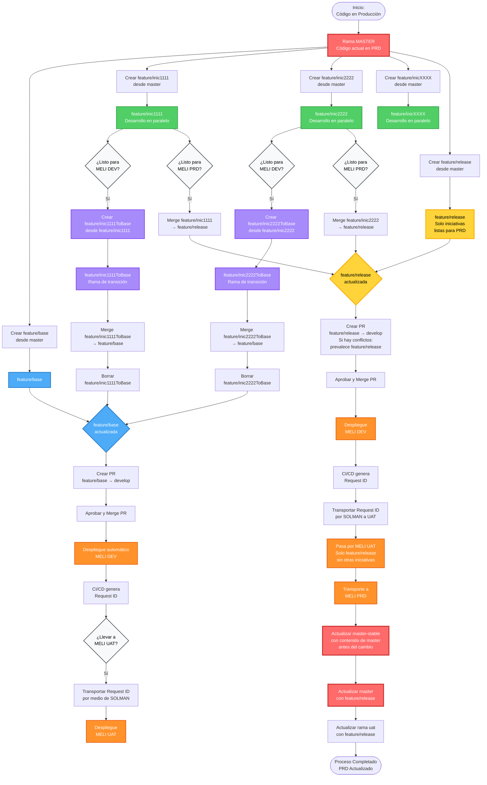

# Flujo de Trabajo GitHub - Desarrollos en Paralelo

## Diagrama de Flujo

## Leyenda de Ramas

| Rama | Descripción |
|------|-------------|
| **master** | Contiene el código que actualmente está en producción (MELI PRD) |
| **master-stable** | Respaldo del estado anterior de master antes de actualizaciones |
| **develop** | Rama protegida que requiere Pull Requests. Desencadena despliegues automáticos |
| **uat** | Rama que refleja el estado del ambiente MELI UAT |
| **feature/base** | Rama de integración para pruebas en MELI DEV y MELI UAT. Agrupa múltiples desarrollos en paralelo |
| **feature/release** | Rama para preparar despliegues a producción. Solo incluye iniciativas completamente listas |
| **feature/inicXXXX** | Ramas individuales para cada iniciativa de desarrollo |
| **feature/inicXXXXToBase** | Ramas de transición temporales para integrar cambios sin afectar la rama original |

## Visualización

Este archivo se puede visualizar en:
- ✅ **GitHub** - Renderiza Mermaid automáticamente
- ✅ **GitLab** - Soporte nativo de Mermaid
- ✅ **VS Code** - Con extensiones: "Markdown Preview Mermaid Support" o "Mermaid Preview"
- ✅ **Obsidian** - Renderiza Mermaid nativamente
- ✅ **Notion** - Soporta bloques de Mermaid
- ✅ **Typora** - Editor Markdown con soporte Mermaid
- ✅ **Mermaid Live Editor** - https://mermaid.live/ (copiar y pegar el código)
