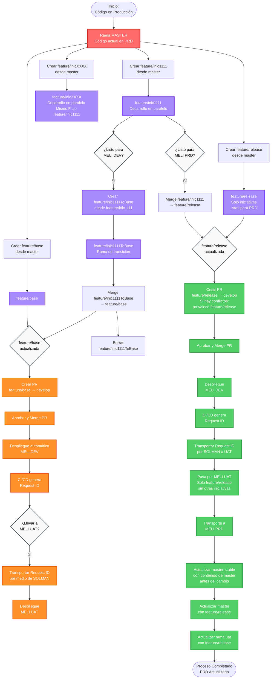

# Flujo de Trabajo GitHub - Desarrollos en Paralelo

## Diagrama de Flujo



## Diagrama de Flujo (Con rama uat)
```mermaid
flowchart TD
    Start([Inicio:<br/>Código en Producción]) --> Master[Rama MASTER<br/>Código actual en PRD]
    
    
    Master --> CreateBase[Crear feature/base<br/>desde master]
    Master --> CreateDev1[Crear feature/inic1111<br/>desde master]    
    Master --> CreateDevN[Crear feature/inicXXXX<br/>desde master]
       
    CreateBase --> Base[feature/base]
    CreateDev1 --> Dev1[feature/inic1111<br/>Desarrollo en paralelo]    
    CreateDevN --> DevN[feature/inicXXXX<br/>Desarrollo en paralelo Mismo Flujo feature/inic1111]
    
    %% Flujo para MELI DEV
    Dev1 --> DecisionDev1{¿Listo para<br/>MELI DEV?}
    DecisionDev1 -->|Sí| CreateTrans1[Crear feature/inic1111ToBase<br/>desde feature/inic1111]
    CreateTrans1 --> Trans1[feature/inic1111ToBase<br/>Rama de transición]
    Trans1 --> MergeToBase1[Merge feature/inic1111ToBase<br/>→ feature/base]
    
          
    Base --> BaseLista
    MergeToBase1 --> BaseLista{feature/base<br/>actualizada}
    MergeToBase1 --> DeleteTrans1[Borrar<br/>feature/inic1111ToBase]
    
    BaseLista --> PRDev[Crear PR<br/>feature/base → develop]
    PRDev --> ApproveDev[Aprobar y Merge PR]
    ApproveDev --> DeployDev[Despliegue automático<br/>MELI DEV]
    DeployDev --> RequestIDDev[CI/CD genera<br/>Request ID]
    
    %% Flujo para MELI UAT
    RequestIDDev --> DecisionUAT{¿Llevar a<br/>MELI UAT?}
    DecisionUAT -->|Sí| TransportUAT[Transportar Request ID<br/>por medio de SOLMAN]
    TransportUAT --> DeployUAT[Despliegue<br/>MELI UAT]
    
    %% Flujo para MELI PRD
    Dev1 --> DecisionPRD1{¿Listo para<br/>MELI PRD?}
        
    
    DecisionPRD1 -->|Sí| PRProd[Crear PR feature/inic1111<br/>→ uat --->Si son varias feature a tranportar primero unificarlas]      
    
    PRProd --> ApproveProd[Aprobar y Merge PR]
    ApproveProd --> DeployDevProd[Despliegue<br/>MELI DEV]
    DeployDevProd --> RequestIDProd[CI/CD genera<br/>Request ID]
    
    RequestIDProd --> TransportProd[Transportar Request ID<br/>por SOLMAN a UAT]
    TransportProd --> UATCheck[Pasa por MELI UAT<br/>Solo feature/inic1111<br/>sin otras iniciativas]
    UATCheck --> TransportPRD[Transporte a<br/>MELI PRD]
    
    %% Actualización post-producción
    TransportPRD --> UpdateStable[Actualizar master-stable<br/>con contenido de master<br/>antes del cambio]
    UpdateStable --> UpdateUAT[Actualizar master<br/>con rama uat]
        
    UpdateUAT --> End([Proceso Completado<br/>PRD Actualizado])
    
    %% Estilos
    classDef mainBranchStyle fill:#ff6b6b,stroke:#c92a2a,stroke-width:3px,color:#fff
    classDef featureBranchStyle fill:#a78bfa,stroke:#7c3aed,stroke-width:2px,color:#fff
    classDef devPathStyle fill:#ff922b,stroke:#e8590c,stroke-width:2px,color:#fff
    classDef prdPathStyle fill:#51cf66,stroke:#2f9e44,stroke-width:2px,color:#fff
    classDef decisionStyle fill:#f8f9fa,stroke:#495057,stroke-width:2px,color:#000
    
    %% Ramas principales: develop, uat, master
    class Master mainBranchStyle
    
    %% Ramas de trabajo: feature/*, master-stable
    class Base,Dev1,DevN,Trans1,CreateTrans1 featureBranchStyle
    
    %% Camino DEV (naranja) - comienza desde PRDev
    class PRDev,ApproveDev,DeployDev,RequestIDDev,TransportUAT,DeployUAT devPathStyle
    
    %% Camino PRD (verde)
    class PRProd,ApproveProd,DeployDevProd,RequestIDProd,TransportProd,UATCheck,TransportPRD,UpdateStable,UpdateUAT prdPathStyle
    
    %% Decisiones e informativos
    class DecisionDev1,DecisionPRD1,DecisionUAT,BaseLista decisionStyle
  
  ```

## Leyenda de Ramas

| Rama | Descripción |
|------|-------------|
| **master** | Contiene el código que actualmente está en producción (MELI PRD) |
| **master-stable** | Respaldo del estado anterior de master antes de actualizaciones |
| **develop** | Rama protegida que requiere Pull Requests. Desencadena despliegues automáticos |
| **uat** | Rama que refleja el estado del ambiente MELI UAT |
| **feature/base** | Rama de integración para pruebas en MELI DEV y MELI UAT. Agrupa múltiples desarrollos en paralelo |
| **feature/release** | Rama para preparar despliegues a producción. Solo incluye iniciativas completamente listas |
| **feature/inicXXXX** | Ramas individuales para cada iniciativa de desarrollo |
| **feature/inicXXXXToBase** | Ramas de transición temporales para integrar cambios sin afectar la rama original |

## Visualización

Este archivo se puede visualizar en:
- ✅ **GitHub** - Renderiza Mermaid automáticamente
- ✅ **GitLab** - Soporte nativo de Mermaid
- ✅ **VS Code** - Con extensiones: "Markdown Preview Mermaid Support" o "Mermaid Preview"
- ✅ **Obsidian** - Renderiza Mermaid nativamente
- ✅ **Notion** - Soporta bloques de Mermaid
- ✅ **Typora** - Editor Markdown con soporte Mermaid
- ✅ **Mermaid Live Editor** - https://mermaid.live/ (copiar y pegar el código)
