# 🚀 Estrategia de Branching Git para MELI

> Gestión de desarrollo paralelo con integración continua y despliegues controlados

## 📋 Tabla de Contenidos

- [Diagrama de Flujo](#-diagrama-de-flujo-completo)
- [Estructura de Ramas](#-estructura-de-ramas)
- [Flujo de Trabajo](#-flujo-de-trabajo-detallado)
  - [Fase 1: Desarrollo](#fase-1-desarrollo-de-iniciativa)
  - [Fase 2: MELI DEV](#fase-2-despliegue-a-meli-dev)
  - [Fase 3: MELI UAT](#fase-3-transporte-a-meli-uat)
  - [Fase 4: Preparación PRD](#fase-4-preparación-para-meli-prd)
  - [Fase 5: MELI PRD](#fase-5-despliegue-a-meli-prd)
- [Reglas y Prácticas](#️-reglas-y-mejores-prácticas)
- [Nomenclatura](#-convenciones-de-nomenclatura)
- [Ambientes](#-ambientes)

---

## 📊 Diagrama de Flujo Completo

```mermaid
flowchart TD
    Start([Inicio:<br/>Código en Producción]) --> Master[Rama MASTER<br/>Código actual en PRD]
    
    
    Master --> CreateBase[Crear feature/consolidate<br/>desde master]
    Master --> CreateDev1[Crear feature/inic1111<br/>desde master]    
    Master --> CreateDevN[Crear feature/inicXXXX<br/>desde master]
       
    CreateBase --> Base[feature/consolidate]
    CreateDev1 --> Dev1[feature/inic1111<br/>Desarrollo en paralelo]    
    CreateDevN --> DevN[feature/inicXXXX<br/>Desarrollo en paralelo<br/>Mismo Flujo feature/inic1111]
    
    %% Flujo para MELI DEV
    Dev1 --> DecisionDev1{¿Listo para<br/>MELI DEV?}
    DecisionDev1 -->|Sí| CreateTrans1[Crear feature/inic1111ToConsolidate<br/>desde feature/inic1111]
    CreateTrans1 --> Trans1[feature/inic1111ToConsolidate<br/>Rama de transición]
    Trans1 --> MergeToConsolidate1[Merge feature/inic1111ToConsolidate<br/>→ feature/consolidate]
    
          
    Base --> BaseLista
    MergeToConsolidate1 --> BaseLista{feature/consolidate<br/>actualizada}
    MergeToConsolidate1 --> DeleteTrans1[Borrar<br/>feature/inic1111ToConsolidate]
    
    BaseLista --> PRDevExists{¿PR feature/consolidate → develop<br/>ya existe?}
    PRDevExists -->|No| CreatePRDev[Crear PR<br/>feature/consolidate → develop]
    PRDevExists -->|Sí| ApproveDev
    CreatePRDev --> ApproveDev[Solicitar aprobación<br/>de PR]
    ApproveDev --> DeployDev[Despliegue automático<br/>MELI DEV]
    DeployDev --> RequestIDDev[CI/CD genera<br/>Request ID]
    
    %% Flujo para MELI UAT
    RequestIDDev --> DecisionUAT{¿Llevar a<br/>MELI UAT?}
    DecisionUAT -->|Sí| TransportUAT[Transportar Request ID<br/>por medio de SOLMAN]
    TransportUAT --> DeployUAT[Despliegue<br/>MELI UAT]
    
    %% Flujo para MELI PRD
    Dev1 --> DecisionPRD1{¿Listo para<br/>MELI PRD?}
    DevN --> DecisionPRDN{¿Listo para<br/>MELI PRD?}
    
    DecisionPRD1 -->|Sí| CheckMultiple{¿Múltiples<br/>iniciativas<br/>a PRD?}
    DecisionPRDN -->|Sí| CheckMultiple
    
    CheckMultiple -->|No - Una sola| PRProdSingle[Crear PR<br/>feature/inic1111 → develop]
    CheckMultiple -->|Sí - Varias| CreateRelease[Crear feature/release-MMDD<br/>desde master]
    
    CreateRelease --> Release[feature/release-MMDD]
    Release --> MergeInit1[Merge feature/inic1111<br/>→ feature/release-MMDD]
    Release --> MergeInitN[Merge feature/inicXXXX<br/>→ feature/release-MMDD]
    
    MergeInit1 --> ReleaseReady
    MergeInitN --> ReleaseReady{feature/release-MMDD<br/>consolidada}
    
    ReleaseReady --> PRProdMulti[Crear PR<br/>feature/release-MMDD → develop]
    
    PRProdSingle --> ApproveProd
    PRProdMulti --> ApproveProd[Solicitar aprobación<br/>de PR]
    
    ApproveProd --> DeployDevProd[Despliegue<br/>MELI DEV]
    DeployDevProd --> RequestIDProd[CI/CD genera<br/>Request ID]
    
    RequestIDProd --> TransportProd[Transportar Request ID<br/>por SOLMAN a UAT]
    TransportProd --> UATCheck[Pasa por MELI UAT<br/>Validación aislada]
    UATCheck --> TransportPRD[Transporte a<br/>MELI PRD]
    
    %% Actualización post-producción    
    TransportPRD --> ConfirmPRD{¿Despliegue<br/>confirmado<br/>en PRD?}
    ConfirmPRD -->|Sí| MergeProd[Ejecutar MERGE de PR<br/>a develop]
    MergeProd --> CheckRelease{¿Es una<br/>release?}
    CheckRelease -->|Sí| UpdateMasterRelease[Actualizar master<br/>desde feature/release-MMDD]
    CheckRelease -->|No| UpdateMasterFeature[Actualizar master<br/>desde feature/inic1111]
    UpdateMasterRelease --> End([Proceso Completado<br/>PRD Actualizado])
    UpdateMasterFeature --> End
    
    %% Estilos
    classDef mainBranchStyle fill:#ff6b6b,stroke:#c92a2a,stroke-width:3px,color:#fff
    classDef featureBranchStyle fill:#a78bfa,stroke:#7c3aed,stroke-width:2px,color:#fff
    classDef releaseBranchStyle fill:#4dabf7,stroke:#1971c2,stroke-width:2px,color:#fff
    classDef devPathStyle fill:#ff922b,stroke:#e8590c,stroke-width:2px,color:#fff
    classDef prdPathStyle fill:#51cf66,stroke:#2f9e44,stroke-width:2px,color:#fff
    classDef decisionStyle fill:#f8f9fa,stroke:#495057,stroke-width:2px,color:#000
    
    class Master mainBranchStyle
    class Base,Dev1,DevN,Trans1,CreateTrans1 featureBranchStyle
    class Release,CreateRelease,MergeInit1,MergeInitN,ReleaseReady releaseBranchStyle
    class PRDevExists,CreatePRDev,ApproveDev,DeployDev,RequestIDDev,TransportUAT,DeployUAT devPathStyle
    class CheckMultiple,PRProdSingle,PRProdMulti,ApproveProd,DeployDevProd,RequestIDProd,TransportProd,UATCheck,TransportPRD,ConfirmPRD,MergeProd,CheckRelease,UpdateMasterRelease,UpdateMasterFeature prdPathStyle
    class DecisionDev1,DecisionPRD1,DecisionPRDN,DecisionUAT,BaseLista decisionStyle
```



### 🎨 Leyenda de Colores

| Color | Descripción |
|-------|-------------|
| 🔴 **Rojo** | Ramas principales (master) |
| 🟣 **Morado** | Ramas feature (feature/inic*, feature/*ToConsolidate) |
| 🔵 **Azul claro** | Ramas release/consolidate (feature/release-MMDD, feature/consolidate) |
| 🟠 **Naranja** | Flujo DEV - Despliegue a MELI DEV/UAT |
| 🟢 **Verde** | Flujo PRD - Despliegue a MELI PRD |
| ⚪ **Gris** | Decisiones y puntos de control |

---

## 🌳 Estructura de Ramas

| Rama | Propósito | Ciclo de Vida |
|------|-----------|---------------|
| `master` | Refleja el código en producción (MELI PRD) | Permanente |
| `develop` | Rama de integración para despliegues automáticos | Permanente |
| `feature/inicXXXX` | Desarrollo de iniciativas individuales en paralelo | Temporal |
| `feature/consolidate` | Rama de consolidación para múltiples iniciativas que van a DEV | Semi-permanente |
| `feature/inicXXXXToConsolidate` | Rama de transición para resolver conflictos antes del merge | Temporal |
| `feature/release-MMDD` | Consolida múltiples iniciativas listas para PRD | Temporal |

---

## 🔄 Flujo de Trabajo Detallado

### Fase 1: Desarrollo de Iniciativa 🔧

**1. Crear rama de iniciativa desde master**

```bash
git checkout master
git pull origin master
git checkout -b feature/inic1111
```

**2. Desarrollar la funcionalidad**

Commits frecuentes en `feature/inic1111`

**3. Crear rama de transición**

```bash
git checkout feature/inic1111
git checkout -b feature/inic1111ToConsolidate
```

**4. Resolver conflictos en la rama de transición**

```bash
git fetch origin
git merge origin/feature/consolidate
# Resolver conflictos si existen
git add .
git commit -m "Resolve conflicts"
```

**5. Hacer merge a feature/consolidate**

```bash
git checkout feature/consolidate
git merge feature/inic1111ToConsolidate
git push origin feature/consolidate
```

**6. Borrar rama de transición**

```bash
git branch -d feature/inic1111ToConsolidate
git push origin --delete feature/inic1111ToConsolidate
```

> 💡 **Nota:** Si ya existe un PR abierto de `feature/consolidate → develop`, simplemente actualiza la rama. Si no existe, créalo y solicita aprobación.

---

### Fase 2: Despliegue a MELI DEV 🚀

**1. Aprobar y hacer merge del PR**

El merge dispara el despliegue automático a MELI DEV

**2. CI/CD genera Request ID automáticamente**

Este ID se usa para transportar el código a otros ambientes

**3. Validación en MELI DEV**

Probar la funcionalidad en el ambiente de desarrollo

---

### Fase 3: Transporte a MELI UAT 🧪

> ⚠️ **Importante:** El transporte a UAT se usa para pruebas de aceptación de usuario o cuando no se cuenta con datos en ambiente MELI DEV.

**1. Transportar Request ID a través de SOLMAN**

Usar SOLMAN para mover el Request ID de DEV a UAT

**2. Validación en MELI UAT**

Realizar pruebas de aceptación o validar con datos reales

---

### Fase 4: Preparación para MELI PRD 📦

> 🔀 **Decisión:** ¿Una iniciativa o múltiples iniciativas van a PRD juntas?

#### Escenario A: Una sola iniciativa

**1. Crear PR directamente**

```bash
# Crear PR: feature/inic1111 → develop
```

**2. Aprobar el PR (NO hacer merge todavía)**

#### Escenario B: Múltiples iniciativas

**1. Crear rama de release**

```bash
git checkout master
git pull origin master
git checkout -b feature/release-1201
# Formato: MMDD (mes y día)
```

**2. Consolidar iniciativas**

```bash
git merge feature/inic1111
git merge feature/inic2222
git push origin feature/release-1201
```

**3. Crear PR desde la release**

```bash
# Crear PR: feature/release-1201 → develop
```

---

### Fase 5: Despliegue a MELI PRD ✅

> ✅ **Flujo de Producción:** El PR aprobado pasa por DEV → UAT → PRD usando SOLMAN.

**1. Despliegue a MELI DEV**

Genera un nuevo Request ID

**2. Transportar a MELI UAT**

Validación aislada vía SOLMAN

**3. Transportar a MELI PRD**

Despliegue final a producción

**4. Confirmar despliegue en PRD**

Validar funcionamiento

**5. Ejecutar MERGE del PR**

Ahora sí hacer el merge a develop

**6. Actualizar master**

```bash
# Release:
git checkout master
git merge feature/release-1201
git push origin master

# Iniciativa individual:
git checkout master
git merge feature/inic1111
git push origin master
```

---

## ⚠️ Reglas y Mejores Prácticas

### 🚫 Prohibiciones Importantes

- **NUNCA** hacer merge directo sin rama de transición
- **NUNCA** hacer merge del PR antes de confirmar despliegue en PRD
- **NUNCA** mezclar iniciativas DEV con PRD en el mismo PR
- **NUNCA** crear release para una sola iniciativa

### ✅ Mejores Prácticas

- ✔️ Usar ramas de transición para resolver conflictos
- ✔️ Borrar ramas de transición después del merge
- ✔️ Mantener sincronizada feature/consolidate con develop
- ✔️ Nombrar releases con formato MMDD
- ✔️ Validar en UAT cuando sea necesario
- ✔️ Documentar Request IDs para trazabilidad
- ✔️ Actualizar master inmediatamente después de PRD

### 📋 Checklist de Despliegue a PRD

- [ ] PR creado y aprobado (NO mergeado)
- [ ] Código desplegado a MELI DEV
- [ ] Request ID generado por CI/CD
- [ ] Request ID transportado a MELI UAT
- [ ] Validación exitosa en MELI UAT
- [ ] Request ID transportado a MELI PRD
- [ ] Validación exitosa en MELI PRD
- [ ] Merge del PR a develop ejecutado
- [ ] Master actualizado
- [ ] Ramas temporales borradas

---

## 📝 Convenciones de Nomenclatura

| Tipo | Formato | Ejemplo |
|------|---------|---------|
| Iniciativa | `feature/inicXXXX` | `feature/inic1111` |
| Transición | `feature/inicXXXXToConsolidate` | `feature/inic1111ToConsolidate` |
| Consolidación | `feature/consolidate` | `feature/consolidate` |
| Release | `feature/release-MMDD` | `feature/release-1201` |
| Request ID | Generado por CI/CD | REQ-2024-001234 |

---

## 🎯 Ambientes

```
┌─────────────┐      ┌─────────────┐      ┌─────────────┐
│  MELI DEV   │  →   │  MELI UAT   │  →   │  MELI PRD   │
└─────────────┘      └─────────────┘      └─────────────┘
```

### 📌 Cuándo usar MELI UAT:

- Para pruebas de aceptación de usuario (UAT - User Acceptance Testing)
- Cuando MELI DEV no cuenta con los datos necesarios para validar

### Descripción de Ambientes:

- **MELI DEV:** Despliegue automático al hacer merge a develop. Ambiente para desarrollo y pruebas iniciales.
- **MELI UAT:** Transporte manual vía SOLMAN. Ambiente para pruebas de aceptación y validación con datos reales.
- **MELI PRD:** Transporte manual vía SOLMAN. Ambiente de producción. Solo se despliega después de validación en UAT.

---

<div align="center">

**Estrategia de Branching Git - MercadoLibre**  
_Versión 2.0 - Diciembre 2024_

</div>
